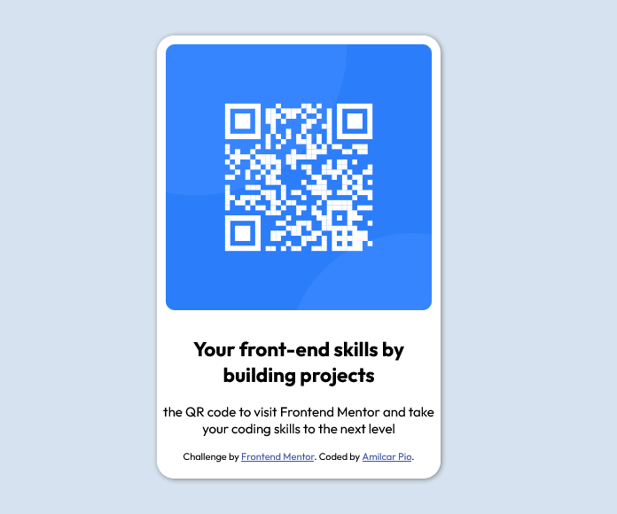

# Frontend Mentor - QR code component solution

## Table of contents

- [Overview](#overview)
  - [Screenshot](#screenshot)
  - [Links](#links)
- [My process](#my-process)
  - [Built with](#built-with)
  - [What I learned](#what-i-learned)
  - [Continued development](#continued-development)
  - [Useful resources](#useful-resources)
- [Author](#author)
- [Acknowledgments](#acknowledgments)

**Note: Delete this note and update the table of contents based on what sections you keep.**

## Overview

### Screenshot



### Links

- Solution URL: [Solution](https://www.frontendmentor.io/solutions/responsive-landing-page-for-a-qr-code-using-css-and-flexbox-2DV0xujMZ)
- Live Site URL: [Live site](https://amilcarpio.github.io/Projetos-frontendmentor.io/)

## My process

### Built with

- Semantic HTML5 markup
- CSS custom properties
- Flexbox

### What I learned

With this project, i learned how to put the container in the middle of the page, using properly the margin and flexbox.

This was my favorite code that i wrote:

```css
.conteiner {
    width: 320px;
    height: 500px;
    border-radius: 20px;
    margin: 0 auto;
    display: inline-block;
    background-color: var(--main-white);
    margin-top: 50px;
    box-shadow: 1px 1px 5px gray;
}
```


### Continued development

By the time, i want to improve my flexbox and grid skills, i think they're the one of the most important skill to have in CSS.

### Useful resources

- [Resource](https://pt.stackoverflow.com/questions/152915/centralizar-div) - This helped me to understand how to put the div in the middle of the page. I really liked this pattern and will use it going forward.


## Author

- Website - [Pio Web Design](https://www.piowebdesign.com/)
- Frontend Mentor - [@amilcarpio](https://www.frontendmentor.io/profile/Amilcarpio)
- LinkedIn - [in/amilcarpio/](https://www.linkedin.com/in/amilcarpio/)

## Acknowledgments

Credits to stackoverflow for help me with this project.
